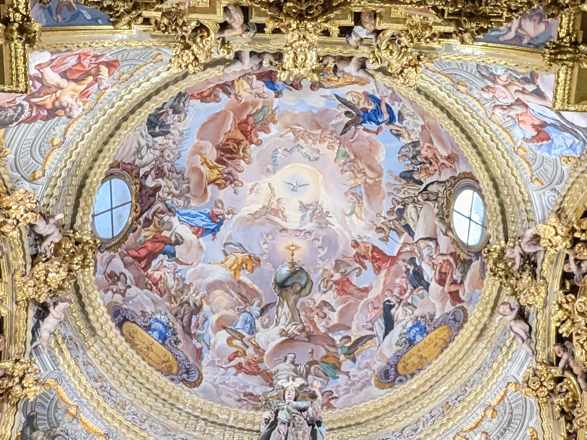
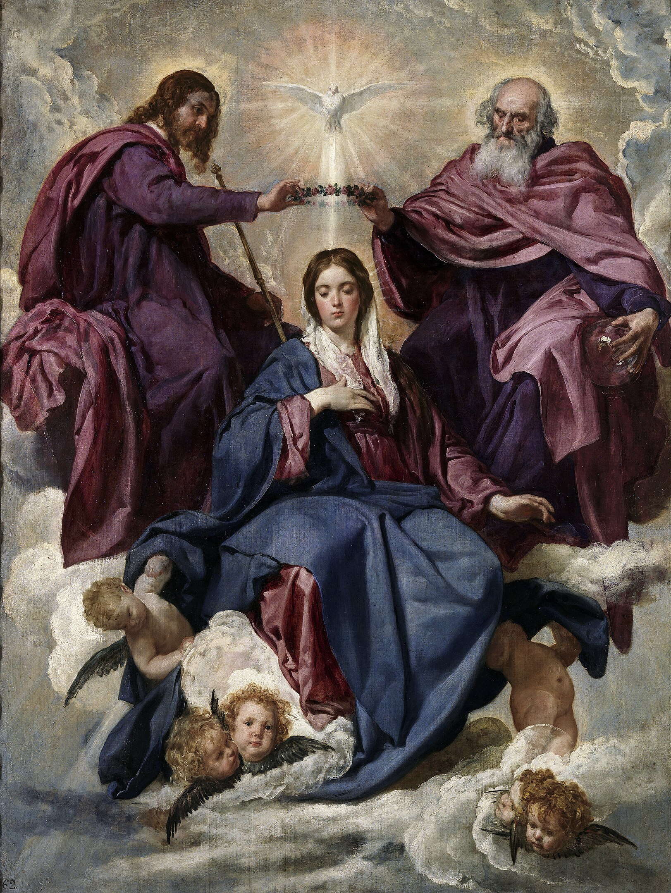

# Referencia: pigmentos usados en varias obras {#pigmentos}

## Azules

### Azurita {#azurita}

La *azurita* es un carbonato básico de cobre [@marai2007arte], Cu~3~(CO~3~)~2~(OH)~2~. Es un pigmento común y llamado por eso *azul citramarino* ya que no se tenía que traer, como el lapislázuli, de más allá del mar. Se le llama también "cenizas azules" o "azul de montaña" y es un pigmento de origen natural, común en Alemania. Cennini, que lo llama *azzurro della Magna* (Alemania) dice [@cennini1859libro]:

> Nasce molto nella Magna, e ancora in quel di Siena

De hecho, hoy en día se puede encontrar en muchos lugares, incluyendo Jerez del Marquesado en Granada, generalmente asociado a la malaquita (de color verde, un simple carbonato de cobre con un grupo CO menos).

Es un color que se mantiene estable, aunque la cal del fresco puede afectarlo, por eso Cennini [@cennini1859libro] dice que se use *al secco*.

### Azul ultramar {#ultramar}

El lapislázuli o azul ultramar también procede de otro mineral del mismo nombre, que se encuentra sobre todo en Afghanistán en esta época; al tener que importarse a Europa desde más allá del mar, sobre todo a través de Venecia, recibió ese nombre. El componente que le da color es la *lazurita*, un silicato de aluminio que incluye también sodio y calcio en su composición.

Parrilla en su tesis [@marai2007arte, p. 91] indica que revela

> el deseo de manifestar piedad sin reparar en gastos.

Cennino se extiende en elogios ("ne voglio parlare largo") sobre el lapislázuli [@cennini1859libro]. Le dedica todo el capítulo LXII de su libro, diciendo de él:

> Azzurro oltramarino si è un colore nobile, bello, perfettissimo oltre a tutti i colori.

Sigue comentando que se machaque en un mortero cubierto, 

> perchè non ti vada via il polvere,

para que no se pierda ni siquiera el polvo. Palomino en su clasificación [@palomino] lo incluye en la el tipo "extraordinario", de los que no se gastan habitualmente. Eso no impidió que lo usara de forma habitual en sus pinturas, aunque nunca en exteriores, por su inestabilidad y tendencia a fusionarse con la cal.

Este tipo de preparaciones se hacían generalmente en el taller, aunque dado el precio del azul ultramarino es posible que el maestro supervisara tanto su adquisición, en ocasiones pagando por parte de quien financia la obra el viaje a Venecia, como su preparación. 

## Blancos

### Blanco de plomo {#bplomo}

El blanco de plomo [@clair2018secret] o albayalde es un carbonato básico de plomo (es decir, carbonato de plomo en un compuesto de coordinación con hidróxido de plomo: 2 PbCO~3~·Pb(OH)~2~) conocido desde la antigüedad. Palomino [@palomino] dice de él que

>... Es el pan de la pintura al ólio, pues sin él no se puede pintar, porque ayuda a todas las colores para graduar los claros, carnes y paños blancos.

Para Palomino [@palomino] se trata de uno de los colores "precisos y usuales", una de las cuatro categorías en las que dividía los pigmentos; esta categoría de pigmentos son aquellos necesarios en cualquier paleta por todas las posibilidades que tiene.

### Carbonato cálcico o blanco de España {#ccalcio}

Al carbonato cálcico (CaCO~3~) se le denomina también [@marai2007arte] blanco de San Juan [@cennini1859libro], creta blanca o blanco de cáscara. Cennini [@cennini1859libro] afirma:

>  e sanza questo non puoi fare niente, come d'incarnazione, e'd altri mescolamenti degli altri colori che si fa in muro

y describe en el capítulo LVIII como prepararlo a partir de la hidratación de la cal. En general, no se usa sino mezclado con otros colores para aclararlos.

Pacheco [@pacheco1866arte] lo denomina *blanco de linda cal*, o *de Portugal* o *Marchena*, e indica, lo comenta en el contexto de la pintura al fresco, y dice que 

> ... sirve en lugar de alvayalde, mesclada con los demas colores

(Libro III, página 365)

## Rojos

### Tierra roja {#almagre}

Se trata de un color cuyo tono va desde el rojo oscuro (sangre) hasta el marrón, dependiendo del aglutinante con el que se mezcle. También se le denomina almagra o almagre, hematites, sinopia y rojo inglés [@marai2007arte]. La base de este pigmento es un óxido de hierro, Fe~2~O~3~, en cristalización romboidal, pero dado que se obtiene del mineral es posible que se encuentre en estado hidratado, lo que le daría diferentes tonos de marrón o amarillo.

Se trata de un pigmento muy estable, que se conoce desde la prehistoria

# Pinturas murales de Palomino en la cúpula del Sagrario de la Cartuja de Granada

**Figura 1**: Cúpula del Sagrario del Monasterio de la Cartuja, foto del autor.

La cúpula del Sagrario del Monasterio de la Cartuja es una pintura al fresco de Antonio Palomino de estilo barroco, realizada entre los años 1712 y 1720 [@roman2020pinturas].

## Descripción general y contexto histórico

Acisclo Antonio Palomino de Castro y Velasco (1655-1726) [@palomino] fue un pintor y tratadista nacido en Córdoba que desarrolló su labor dentro del barroco andaluz y español. A partir de su contacto con Luca Giordano, llegado a Madrid para un encargo real, se interesa por la técnica del fresco y a partir de ese momento desarrollaría su labor en diferentes edificios religiosos como la basílica de los Santos Juanes o de los Desamparados en Valencia aparte de la que nos ocupa, la Cartuja de Granada, de las últimas obra en la que trabajaría antes de su muerte (la última sería el sagrario de la Cartula de El Paular) y, por tanto, una obra en la que reflejaría toda su maestría en la composición, la luz, y dominio de la preparación y la técnica pictórica.

La cúpula se encuentra en el Sagrario o *Sancta Sanctórum*, concebido en la arquitectura cartujana como un espacio "oculto" detrás del altar y destinado principalmente a la adoración privada de los cartujos, por separado de los frailes legos [@lozano2023orden], configurándolo de forma que "proteja del mundo exterior" [@ramos2021arquitectura]. El arquitecto Francisco Hurtado diseñó este espacio con un todo unitario que integra la arquitectura, la escultura y la pintura, tanto al fresco como de caballete, como una *máquina de rezar* y de exaltación de la Comunión y de la orden cartujana; sin embargo, este arquitecto falleció sin llegar a ver su ejecución completada.

Como tal espacio privado, la composición arquitectónica del espacio dirige la mirada hacia la cúpula, y esta cúpula es una espiral de escenas en cuyo centro está el Espíritu Santo, en un círculo dorado que parece romper la estructura de la cúpula, abriéndose al cielo. Los dos óculos reales, al norte (norte-nordeste, en realidad) y al sur (sur-suroeste), dan luz al espacio a cualquier hora del día [@almagro2010planimetria]. Se buscaba que los monjes fueran capaces de entender el significado simbólico de esta decoración, que se divide en dos vertientes: la eucarística y la monástica. La primera es la principal clave de la cúpula, aunque también representa a San Bruno llevando en sus hombros al mundo, pero este es un simple pedestal para la custodia eucarística; San Bruno está alineado con la misma y con el Espíritu Santo y con el centro de la Trinidad, que ocupa el centro de la cúpula.

El planteamiento iconográfico de la cúpula lo describe el propio Palomino hablando de la cúpula del monasterio de El Paular, del mismo autor y realizado a continuación, capítulo XIV del Libro Nono del Tomo Segundo de [@palomino]; aunque hay diferencias, los elementos principales son comunes: 

> En ellugar mas supremo se mirará la Trinidad santísima en un gran trono de nubes, asistida de angeles, y serafines [...] María santísima, coronada reyna de los angeles [...] al otro lado San Juan Bautista, y san Joseph

La profusión de figuras, aunque más contenida y mejor perfilada que la de los Desamparados en Valencia, tiene forma de *apoteosis barroca* [@roman2020pinturas] y ciertas similitudes con la cúpula de la escalera del Escorial creada por Lucas Giordano; en esta apoteosis, la perspectiva se ha realizado con precisión, siguiendo los preceptos matemáticos que el propio Palomino estudió y desarrolló en sus escritos.

En un contexto más amplio, la exaltación de la Eucaristía como sacramento católico forma parte del movimiento de rearme espiritual propiciado por la Contrarreforma del concilio de Trento. Al rechazar la transusbstanciación, el protestantismo convirtió a la comunión en un punto de debate. En pinturas tales como esta se trata de mostrar ese concepto abstracto, la presencia en cuerpo y sangre de cristo en la comunión, de forma simbólica y comprensible para todos, aparte de resaltar el triunfo de la Comunión sobre los pecados del mundo, simbolizados por la custodia culminando la bola del mundo.

Esta devoción eucarística, centrada en el Sagrario como tipología arquitectónica típica de las cartujas españolas, tienen su culmen en este, y su foco en la cúpula, verdadero centro iconográfico y también religioso de la misma [@deCeballos], con el contexto añadido del recogimiento y silencio característico de la orden cartuja.

Las diferentes capas pictóricas están al servicio de esta iconografía. Las veremos a continuación.

## Materiales y técnicas de ejecución

Palomino era un verdadero experto tanto en la teoría como en la práctica de la pintura, especialmente al fresco. Las técnicas y materiales reflejarán esa experiencia y aunque en muchos casos no tengamos datos específicos de la cúpula del Sagrario, podemos deducir la técnica usada por la encontrada en otras obras similares, como la cúpula de la basílica de los Desamparados o la de los Santos Juanes. El mismo Palomino dice, al principio del capítulo IV de su libro séptimo, qu e trata precisamente de "La práctica, y observaciones, de la Pintura al fresco":

> [...] no es para copiantes, ni pintores tímidos.

### Preparaciones

En la tesis de la doctora honoris causa por la UGR Pilar Roig [@Roig90] y una vez más en la tesis de la ahora doctora Soriano Sancho [@soriano2008frescos] se afirma:

> La obra presenta unas características particulares, pues, habiendo sido pintadas al fresco, sobre intonaco de cal y arena, presenta unos morteros preparatorios internos a base de yeso -y no de cal- como cabría esperar en una ortodoxa técnica al "buon fresco".

La frase entre guiones (y entre paréntesis en la tesis original) parece que indica que:

> La obra presenta [...] unos morteros preparatorios internos a base de yeso [...] como cabría esperar en una ortodoxa técnica al "buon fresco"

El *buon fresco*, sin embargo, usa cal en la primera capa. En comunicación personal con la doctora Roig por correo electrónico me ha confirmado que la frase se debía de entender de esta forma:

> La obra presenta unas características particulares, pues, habiendo sido pintadas al fresco, sobre intonaco de cal y arena, presenta unos morteros preparatorios internos a base de yeso, y no de cal como cabría esperar en una ortodoxa técnica al "buon fresco".

Cosa que, por otro lado, está confirmada en la explicación de la nota 3 a pie de página de la tesis de la doctora Soriano [@soriano2008frescos], que dice:

> [Palomino usa] técnicas de ejecución artística diferentes a las tradicionalmente empleadas en la
realización de pintura al fresco

Por lo tanto, los morteros preparatorios usarían en su primera capa *yeso* y a continuación un *intonaco* de cal y de arena, dispuestas en tres capas [@BoschRoig] aparte del dibujo preparatorio y jornadas:

* Una enfoscado de yeso sobre el muro de ladrillo, que tendría "yeso, anhidrita, basanita, calcita y cuarzo".
* Una segunda capa de yeso sobre la anterior, la capa de *arriccio*, con la misma composición
* Entre esta capa y la siguiente se ha encontrado en el caso de los Santos Juanes una capa de [tierra roja o sinopia](#almagre), que incluye el dibujo preparatorio; como es habitual, el dibujo preparatorio está *por debajo* de la última capa sobre la que se aplica directamente la pintura.
* Una tercera capa, *intonaco*, de calcita y cuarzo que usa mortero de cal como aglomerante y arena como carga inerte, llamada *estuque* por el propio Palomino. Sobre esta última se aplicaría directamente la pintura.

En la tesis de Soriano Sancho [@soriano2008frescos] se presenta en la figura 8, página 30, un esquema de esta preparación.

### Dibujo preparatorio

Segun Bosch Roig [@BoschRoig] el boceto se realiza sobre cartón, y luego se traslada a base de incisiones usando un lápiz o punzón. En el mismo artículo se afirma que se usa **sinopia** o tierra roja tanto para este boceto como para el trazado de las jornadas.

### Aglutinantes

El fresco usa, en general, la propia cal del mortero como aglutinante. En el caso de los Santos Juanes, Sánchez Pons en su tesis [@SanchezPons, p. 31] afirma que se usa también cola animal en los retoques al seco y en los dorados; Soriano Sancho [@soriano2008frescos, p. 94 ] indica que se usa caseína de la leche.

### Pigmentos

Una vez más, no se conocen específicamente los colores usados en esta cúpula, así que tenemos que guiarnos tanto por el estudio que se ha hecho de los Santos Juanes [@BoschRoig] como de la propia guía de Palomino [@palomino], en la sección V del capítulo mencionado anteriormente; este afirma que todos los pigmentos son minerales. Se especifican a continuación. Aparte de los indicados, en la tesis se menciona también la presencia de ocres amarillos o rojizos y pigmento tierra con carbonato de plomo, pero no parece que en este fresco se usen extensivamente.

#### Blanco

Usa simplemente cal sola, o **blanco de cal**; también se ha encontrado mármol blanco o alabastro molido.

#### Amarillo

Usó **amarillo de Nápoles**^[Que puede ser o no igual a la hornaza, puesto que en algunos casos parece que denominan así a un compuesto de antimonio y no de plomo] u **hornaza**, que se crea a partir de la cocción de minerales que contienen plomo; por eso se le llama también amarillo de plomo; sin embargo, el pigmento llamado hornaza no tiene una composición específica, salvo que tiene óxidos de plomo (posiblemente en su forma PbO).

Palomino lo usa de forma bastante extensiva para los fondos dorados, y en mezcla con otros pigmentos para conseguir tonalidades más cálidas en las nubes, por ejemplo.

#### Azul

**Azul de montaña** (es decir, [azurita](#azurita)), [**azul ultramar**](#ultramar) y **azul esmalte**. A pesar de que esto no es habitual, para aclarar el azul ultramar o simplemente para economizarlo lo mezcla con yeso y [albayalde](#bplomo) a partes iguales.

En esta obra se usa, como es natural, en el manto de la Virgen, pero también se ven trazas de este azul en un jarrón encima de un medallón y en alguna otra vestimenta, por ejemplo de un ángel.

El azul esmalte, también llamado *cerúleo* [@marai2007arte] es, aparentemente, usado en el cielo y de forma extensiva. Es un silicato potásico con óxido de cobalto, con este último metal responsable del color azul; como tal y por su similitud con el cielo se usa habitualmente para expresar la idea de infinito [@clair2018secret]. En esta obra se usa para crear un fondo de color frío que lance hacia el primer plano las figuras y las nubes doradas en las que se encuentran, acercándolas a la persona que está abajo en adoración.

#### Rojo

El rojo se usa de forma bastante extensiva en las vestimentas de los santos, ángeles y la Virgen; en el caso de San Juan Bautista y la Virgen tratan de simbolizar la pasión. Los pigmentos que se usan son **carmín** (del tipo albín o pavonazo) y [**tierra roja**](#almagre); también se usa como parte de una mezcla para crear rosas, tan característicos del barroco, malvas y morados.

El albín o pavonazo es un óxido de hierro que se usa para emular al carmín en el fresco [@marai2007arte] y como parte de la mezcla que se usa para crear las carnaciones [@palomino, p. 153]. Dado que por ese nombre^[En realidad, escrito *pabonazo*] solo aparece en el tratado de Palomino [@palomino], que no se caracterizaba precisamente por la precisión química (entre otras cosas porque la formulación todavía no se había inventado), es difícil saber la composición exacta del mismo, aunque el color rojo oscuro es característico de los óxidos de hierro en su estado de oxidación 3, así que es posible que se trate de Fe~2~O~3~.

La tierra roja es posible que se use para dar tono dorado a las nubes o en mezclas para rojos más oscuros o morados.

#### Verde

El color verde se usa notablemente para representar las tierras emergidas en el globo terráqueo que sostiene San Bruno; también en la ropa de San Pedro, las guirnaldas que sostienen los *putti* y otras vestimentas diferentes.

El pigmento que se usa es **tierra verde**, un pigmento natural de arcilla que contiene silicatos ferrosos (de hierro II) y manganeso, aunque tratándose de un producto natural cualquier tierra con un tono verde acaba llamándose de esta forma aunque tenga una composición muy diferente; Palomino la denomina también tierra de Verona o verdacho, aunque este último término se usa específicamente para la base de las encarnaciones [@marai2007arte].

El mismo Palomino califica a este color de "preciso y usual" en el caso del óleo, aunque también lo recomienda para frescos tales como este [@palomino, p. 358].

### Dorados

Según Bosch Roig [@BoschRoig] están hechos con:

> ... finas láminas de oro fijado mediante un adhesivo (barniz, esencia de trementina, pez griega y cera de abeja)

### Retoques

En la pintura al fresco no se usan veladuras, pero sí retoques, en muchos casos *al secco*. Según Bosch Roig, se aplican retoques con un aglutinante proteico tal como la caseína de la leche; también se usa lámina de oro para zonas con brillo. En la Cartuja se pueden identificar este tipo de zonas doradas en el cáliz que lleva la Fe, en la custodia sobre el mundo que sujeta San Bruno y en la corona de la Virgen, aunque es posible que, como indica Bosch Roig, se use solo en las zonas brillantes. Véase en todo caso la sección sobre [dorados](#dorados) para ver la técnica que se usa para aplicar los mismos.

## Conclusiones

Aunque no tenemos mucha información específica sobre la cúpula de la Cartuja, la información que se ha recabado y que se ha contrastado con los pigmentos y otras preparaciones existentes en la misma permiten ver la maestría de Palomino en el diseño de la obra y la precisión a la hora de obtener un efecto óptico, pero también iconográfico o religioso, determinado. El hecho de que se trate de una pintura al fresco permite apreciar como interaccionan los pigmentos con el aglutinante para conseguir un color, y las diferencias que puede haber, en pigmentos usados o en color obtenido, entre las mismas.

# El Descendimiento de Roger van der Weyden, Museo Nacional del Prado

**Figura 2**: El Descendimiento de Van Der Weyden, imagen de dominio público [descargada de Wikimedia Commons](https://es.m.wikipedia.org/wiki/Archivo:El_Descendimiento,_by_Rogier_van_der_Weyden,_from_Prado_in_Google_Earth.jpg#).

El Descendimiento es un óleo sobre tabla realizado por Rogier de la Pasture/van der Weyden^[versión francesa o flamenca del mismo nombre, que significa "de la vega"] entre 1535 y 1437 [@alcalde02].

## Descripción general y contexto histórico

Van der Weyden (usaremos su nombre flamenco, ya que nació en una localidad flamenca) nació en Doornik/Tournai en 1399, en lo que entonces era Borgoña, llegando a convertirse en pintor oficial de la corte en Bruselas [@gregory85:_van_weyden]. Se formó como aprendiz de Robert Campin, otro pintor de la misma ciudad. Junto con el resto de los denominados "Primitivos flamencos", como Van Eyck, fue la primera escuela que utilizó el óleo y se esforzó en un mayor realismo, logrado a través sobre todo de la extrema atención al detalle.

En esa época en los Países Bajos y Alemania se ha implantado una corriente reformista de la iglesia denominada *devotio moderna* [@salas2022devotio]. La *devotio moderna* busca una experiencia personal de la religión, incluyendo experimentar los sufrimientos de Cristo y la Virgen María y empatizar con los mismos. En el arte, esto se traduce en la creación de cuadros de pequeño formato para la devoción personal, que a su vez necesitan detalles, así como un color vivo y vibrante, que refleje todos los matices del sufrimiento. Esta necesidad de detalle y de color es posible que fueran factores en el uso de las técnicas pictóricas tales como los pinceles de un solo pelo y el uso de veladuras para conseguir profundidad del color y volumen en las figuras.

Como también se refleja en los cuadros de Van Eyck, la actividad comercial de los Países Bajos era considerable y estaba agrupada sobre todo en gremios, que encargaban cuadros a los diferentes artífices para mostrar en sus locales gremiales o adornar las capillas dedicadas por ellos en las iglesias. En concreto, este cuadro fue encargado por el Gran Gremio de los Arqueros (encargados, entre otras cosas, de fabricar ballestas en esta época) para la capilla de Nuestra Señora Extramuros de Lovaina [@campbell04].

El cuadro, fechado *antes de 1443* [@alcalde02] era parte de un retablo cuyas alas se han perdido, y refleja el momento del descendimiento de Cristo después de su crucifixión, correspondiendo tanto a la tipología de un Descendimiento como a la de un *compianto* o lamento por la muerte de cristo, con las siete figuras habituales en esta tipología: Las tres Marías (que incluyen a la Virgen), Nicodemo y San José de Arimatea, Cristo, la Magdalena y San Juan Evangelista, que tradicionalmente va vestido de rojo. Hay dos figuras adicionales, una de las cuales podría corresponder a algún cargo del gremio que hizo el encargo. El gremio también aparece reflejado a base de pequeñas ballestas disimuladas como parte del marco pintado en trampantojo.

El cuadro es notable por el realismo de las figuras, pero también por la precisión con la que se reflejan diferentes fases y niveles de dolor ante la muerte de Cristo. Esta es una característica de la *devotio moderna*, que trata de presentar a las figuras evangélicas como humanas y por tanto cercanas, figuras con las que se puede empatizar. La postura de desvanecimiento de María se denomina *spasimo* y en este caso se usa de forma estructural en el cuadro, en paralelo al cuerpo de Cristo, y a la vez creando un ritmo diagonal en el cuadro, interrumpido por el paralelismo vertical del brazo de Cristo y el de María.

La cualidad casi escultórica de las figuras, "atrapadas" en una especie de nicho [@Krauth78], las empuja hacia el espectador, a la vez que las atrapa simbólicamente en un momento del cual no pueden escapar. Van der Weyden elimina todo tipo de fondo o perspectiva para que la atención se centre solamente en el momento del descendimiento y en el sufrimiento individual de cada una de las personas que asisten al mismo.

Los materiales reflejan la historia de la pieza, que tras ser instalada en la capilla para la que se creó, acabó en el Escorial, para lo que tuvo que ser desmontada, y finalmente fue instalada en el Museo del Prado  [@veliz2016caring], donde sufrió un proceso de restauración extensivo en los años 80 y 90 del siglo pasado [@miller2011development].

## Materiales y procedimientos

### Soporte

 La arquitectura gótica que llenó de luz espacios litúrgicos antes oscuros, y la nueva riqueza de gremios tales como este propició la difusión del retablo como soporte para la pintura [@retablos]. Combinado con el uso del óleo y la existencia de talleres de pintores, el retablo se convirtió en un producto que se podía encargar y transportar, llevarse a cabo en menos tiempo que un fresco, y que al ser portable, se podía cambiar de lugar o sustituir en caso de cambios políticos, religiosos o litúrgicos. Combinado con la *devotio moderna* que pedía imágenes portables para la devoción personal, y la pericia tecnológica y artística alcanzada por los carpinteros de la época, se explica la popularidad de este tipo de soporte, que alcanzaría su culmen más adelante, durante la Contrarreforma.

Como casi todos los primitivos flamencos, el soporte que se usa es roble del Báltico [@roble].
Las tablas están estructuradas en 11 tableros verticales [@asperen1983algunas]

> [unidos] mediante tres espiches de madera en cada junta, salvo en las centrales que son cuatro por ser de mayor tamaño.

La madera fue cortada tangencialmente al tronco, en un patrón (de "llama" o "catedral") que se observa con cierta claridad en las imágenes publicadas del reverso. Este tipo de corte es el más económico, ya que aprovecha todo el tronco. Dado que el roble báltico lo tenían que traer a Borgoña desde muy lejos, era importante aprovecharlo, aunque su dilatación y contracción fuera mayor que con otro tipo de cortes.

Los bordes son biselados para poder incluirse en el marco original, que sin embargo se ha perdido; este marco posiblemente tuviera la misma apariencia que el marco en trampantojo incluido por el mismo cuadro.

Adicionalmente, en los años 90 se le añadió un mecanismo basado en muelles, desarrollado en el Metropolitan de Nueva York, que permita la expansión y contracción del cuadro con más sencillez [@miller2011development] y permitiendo ajustes de la tensión tanto en horizontal como en vertical. Sobre cada unión entre las tablas, embutidas a media madera, hay cuatro colas de milano; las tablas centrales, sin embargo, tienen 5 por ser más grandes [@asperen1983algunas]. El marco es de madera resinosa y reforzado con listones de madera; no es el original, pero sí es antiguo, aparentemente del siglo XIX.

### Preparaciones

La imprimación se ha hecho con una capa de carbonato cálcico ([blanco de España](#ccalcio)) y cola [@SpringMarika2012TmoR]. La mezcla de blanco de España con colas animales se suele denominar *gesso* y ya se describió en el tratado de Cennino Cennini [@cennini1859libro]. En su capítulo CXV afirma sobre la preparación de una tabla:

>  Poi abbi gèsso grosso, cioè volterrano, ch'è purgato, ed è tamigiato a modo di farina.

A este tipo de imprimación, *imprimación a la creta* por el mineral que se machaca para obtener el carbonato cálcico [@thompson1956materials]. Este tipo de preparación para tabla se popularizó en Italia desde el siglo anterior, y se adoptó en otras escuelas pictóricas. 

Adicionalmente, y por encima de la capa de dibujo (que trataremos a continuación) hay una capa de *imprimatura* de blanco de plomo (véase [la referencia sobre el mismo](#bplomo)) con pigmento rojo opaco (minio) y algún negro (como afirma Spring [@SpringMarika2012TmoR] citando a Garrido Perez et al.  [@perez1994proceso]). Esta capa tendría un color gris rosáceo, según la fuente, seguramente contribuyendo sobre todo a las carnaduras de los diferentes personajes. Esta capa de imprimación es necesaria para que la la capa inicial no absorba demasiados pigmentos de las capas pictóricas [@Krauth78].

Las imprimaturas basadas en plomo son, con diferentes combinaciones, habituales en la pintura de los primitivos flamencos; y aunque no es totalmente blanca como podría ser lo aconsejable, sigue siendo una capa de un color ligero sobre la que trabajar; de hecho, es lo habitual en otras pinturas de esa época.

En cuanto al rojo de minio [@perez1994proceso] se trata de tetraóxido de plomo y se obtiene de la misma forma que el blanco de plomo calentándolo; al necesitar este proceso de calentamiento, es uno de los primeros pigmentos generados artificialmente; y esto es así desde Plinio el Viejo, que describía el proceso llamándolo *minium secundarium* (el *primarium* sería el cinabrio).

Por su tendencia a ennegrecerse y también por mezclarse mal con otros pigmentos como el blanco de plomo, en esa época se usaba preferentemente como preparación, usando otro tipo de colores (como el bermellón) para el rojo en la capa pictórica [@clair2018secret].

### Dibujo subyacente

El artículo de Asperen et al. [@asperen1983algunas] presenta un panorama bastante completo del dibujo subyacente en las diferentes partes del cuadro. Se da con pinceladas ligeras que no siempre corresponden con la superficie pictórica, usando técnicas específicas para las sombras, trazos "de tipo colmillo" (para superficies planas) y líneas paralelas para formas más profundas. Donde menos diferencia hay con el dibujo subyacente es la ropa; en las caras, sin embargo, hay muy poca coincidencia. 

También hay algunas correcciones en posiciones del cuerpo y en la ropa que se pueden apreciar en los diferentes reflectogramas infrarrojos realizados y presentados en el trabajo anterior. Por otro lado, este dibujo no está presente en todas las tablas del cuadro [@perez1994proceso, p. 238].

No he encontrado qué tipo de pigmento se usa para realizar dibujo subyacente, pero en esta época se hacía normalmente con carboncillo. En todo caso, se encuentra al parecer debajo de la imprimatura y encima de la capa de preparación de yeso.

### Aglutinantes

Como es lo habitual en el óleo, se usa aceite de linaza como aglutinante. En este caso específico, tras la restauración por "El Mudo" [@veliz2016caring], se usó también aceite de nuez para restaurar las pérdidas de material de la pintura.

El óleo, que se comenzó a usar por primera vez de forma extensiva por parte de los primitivos flamencos, que por primera vez lo emplearon para *toda* la pintura, les permitió desarrollar *sistemas de pintura* [@bol2012painting] específicos para carnación y también el agua con los cuales alcanzaron nuevas cotas de realismo. Estos sistemas incluían desde la imprimación hasta diferentes capas de veladuras, como veremos en el apartado correspondiente.

El aceite de linaza, al tener un índice de refracción similar a los pigmentos más vivos tales como el azul ultramarino [@Krauth78], permite ver la luz reflejada por tales pigmentos en toda su calidad y vivacidad; si los índices refractivos del pigmento son similares a los del medio se intensifica el color.

### Pigmentos

Los pigmentos usados están sacados del artículo de Asperen et al. [@asperen1983algunas]. En general, se usan colores muy vivos como corresponde a la *devotio moderna*, que trata de hacer más realistas las figuras divinas para acercarlas a los devotos. Por la misma razón se usa una paleta de colores cálidos que crean un planos que acercan la pintura al espectador, dándole una calidad casi escultórica, como si fuera un retablo escultórico colocado en un nicho en la pared, nicho que se representa como si se tratara de un trampantojo. También es una paleta relativamente reducida, tratando de conseguir sombras y tonos con veladuras (que se verán más adelante).

Los colores y los pigmentos correspondientes que se mencionan en el artículo anterior con:

#### Blanco

Para el blanco se usa [blanco de plomo](#bplomo), usado "con rigor" [@asperen1983algunas] y principalmente para las zonas de luz y paños claros

#### Carnaciones

Reflejar el color de la piel humana es  una de las técnicas más complicadas de dominar y los primitivos flamencos fueron los primeros que lo consiguieron de forma realista, una vez más impulsados por su adhesión a la *devotio moderna* que buscaba una identificación del devoto con las figuras divinas representadas en la pintura [@bol2012painting].

La representación de la carnación no solo afecta a la capa pictórica sino también al resto de las capas, requiriendo todo un *sistema de pintura* [@bol2012painting] para conseguir la semi-transparencia característica de la misma; en este apartado, sin embargo, sólo hablaremos de los pigmentos usados en la misma.

En esta pintura se han usado, por tanto, mezclas de blanco de plomo con diferentes pigmentos, con más carga del mismo en el caso del cuerpo de Cristo, mostrando la palidez mortal; también en el caso de la Virgen. Recordemos en todo caso la tercera capa de imprimación por encima del dibujo subyacente, que precisamente trata de modelar o dar una base para las mismas.

Por lo tanto, la carnación es un resultado de varias capas de pintura, que de acuerdo con [@Metzger01011998], que las analizó para un retrato de Van der Weyden, pueden incluir:

- [**Blanco de España** o carbonato cálcico](#ccalcio).
- **Carmín**, que en este caso se trataría de quermes [@marai2007arte], un azúcar (C~22~H~20~O~13~), un producto que se comercializaba desde Venecia y se producía en varias áreas del Mediterráneo a partir de la hembra de un insecto hemíptero llamado de la misma forma, *quermes*. Para Palomino [@palomino] este tipo de carmín se enmarcaba dentro de los pigmentos "preciosos, floridos y costosos".
* **Negro carbón** y **negro de hueso**
* **Tierra roja**: se trata de un óxido de hierro, Fe~2~O~3~. También se llama almagra.
* **Tierra amarilla** u **ocre**: se trata de un óxido de hierro hidratado FeO(OH).
* **Génuli** o **amarillo de plomo**: Un óxido de plomo, se obtiene al quemar el [blanco de plomo](#bplomo), pero también de forma natural. Su fórmula es PbO.

Aunque todos estos colores se han encontrado en otra pintura del mismo autor analizada de forma extensiva, es muy probable que en esta se encuentren también, especialmente los más comunes. 

#### Negro

En el artículo de Asperen et al. [@asperen1983algunas] afirma "sin determinar" el pigmento que usa, aunque el de Pérez Garrido et al. [@perez1994proceso] dice que son "de origen orgánico"; es decir, se tratará con mucha probabilidad de **negro carbón**.

El negro se usa tanto en la ropa, por ejemplo el turbante de José de Arimatea, como en el pelo de algunos personajes, Cristo y San Juan Evangelista, así como para las sombras en todo el cuadro. Como se ha visto también en la [sección sobre las carnaciones](#carnaciones), también se combina con otros colores para conseguir diferentes tonos de piel.

#### Azul

A diferencia de otros colores que aparecen distribuidos por todo el cuadro, el azul se usa casi exclusivamente en el manto de la Virgen, con el rico tono característico tanto en *compianti* como en toda la representación renacentista de la Virgen.

Como en la mayoría de esos casos, se usa el [**azul ultramar**](#ultramar) para ese vestido, si bien está combinado con la [**azurita**](#azurita) [@asperen1983algunas]e, en este artículo muestran una microfotografía del manto de la virgen donde se ve una capa a base de azurita mezclada con [blanco de plomo](#bplomo), seguida de dos capas de veladuras que, en este caso, usan lapislázuli^[ [@asperen1983algunas] comenta que esta proporción, 2 de lapislázuli por 1 de azurita, lo hace mucho más caro que la usada en el Retablo de Gante de Van Eyck, que tiene 3 de azurita por 1 o 2 de [lapislázuli](#ultramar).

Van der Weyden intensifica aquí el volumen de la túnica con los detallados pliegues, modelados de forma realista, que dejan en sombra toda la parte izquierda del manto, la más cercana a la calavera de Adán, la más cercana a la muerte. La gradación del oscuro en la parte izquiera del manto con la luz en la parte más cercana a Cristo quiere simbolizar la redención traída por Jesucristo, "la luz del mundo".

#### Verde

El verde lo encontramos sobre todo en el suelo, representado de forma muy esquemática, y en diferentes tonos en los mantos de la Magdalena y de María Salomé. Según Asperen et al. [@asperen1983algunas] se trata de **resinato de cobre**, es decir, **verdigris**, también denominado **cardenillo**. A veces se le llama también [@marai2007arte] acetato de cobre; dependiendo de su obtención: aplicación de resinas calientes a una sal de cobre (resinato) o disolución de cobre en vinagre o vino pasado (acetato). En la misma obra se cita como fórmula Cu(CH3-COO)~2~·2Cu(OH)~2~, aunque la composición dependerá del proceso seguido; en todo caso, es un pigmento de cobre, cuya fórmula y obtención se conoce desde la antigüedad.

#### Naranja

Encontrado principalmente en las mangas del vestido de la magdalena y en las calzas de Nicodemo, [@asperen1983algunas] afirma que se trata de **bermellón de mercurio**, se diferencia del *cinabrio* principalmente por su obtención artificial a base de azufre y mercurio en vez de su origen natural; efectivamente, su fórmula es HgS.

Este color naranja, un color cálido situado precisamente en la figura que sostiene a Cristo y la que está a sus pies, crea un fuerte contraste con los colores fríos del resto del cuadro, especialmente los tonos de piel pálidos de Cristo. Una vez más y en el marco de la *devotio moderna*, Van der Weyden usa los tonos de color para acentuar el sufrimiento y lograr la empatía por parte del espectador.

#### Marrón

Este color se encuentra sobre todo en la vestimenta de José de Arimatea; según el artículo de Asperen et al. [@asperen1983algunas] se trata de óxidos de hierro, pudiendo tratarse de Fe~2~O~3~ con alguna mezcla^[El color marrón del hierro está asociado al estado de oxidación +3, es decir, Fe(III). Mezclado con otros óxidos puede rebajarse la tonalidad a un marrón más amarillento. El mineral más común con este color es la hematita, con un color marrón rojizo o rojo oscuro (sangre). El índice refractivo de este óxido es casi el doble que el del aceite de linaza, por lo que el color percibido en un cuadro cambiará con respecto al índice natural, haciendo más opaco el material que por tanto se percibirá como más oscuro al no dejar pasar la luz reflejada por la capa de imprimación de color claro].

#### Amarillo

Junto con el marrón, forma parte de la vestimenta de José de Arimatea. En este caso, [@asperen1983algunas] habla de **amarillo de plomo y de estaño**. Ramírez Barat el al. [@barat2002identificacion] afirma que se trata de PbSnO~3~, aunque con partículas de dióxido de estaño^[Hay dos variadades de este tipo de óxido; Ramírez Barat afirma que en este caso se ha demostrado qu ese trata del tipo II, con la fórmula indicada].

Hay bastante confusión en la literatura entre este pigmento y el **amarillo de Nápoles**, que es un simple óxido de plomo; el artículo anterior indica que se correspondería con el **hornaza**, creado a partir de restos de cerámica, de Palomino [@palomino], aunque este último indica (Sección VI, Capítulo IV, libro séptimo) que se usaría principalmente para el fresco, no el óleo.

#### Rojo

El rojo, evidente sobre todo en la vestimenta de San Juan Evangelista, está hecho [@asperen1983algunas] de laca orgánica roja y bermellón de mercurio, un componente que aparece también en el [naranja](#naranja).

### Dorados

Se aplica sobre todo al fondo, tratando de reflejar esa luz divina que ilumina de forma uniforme toda la escena; según Asperen et al. [@asperen1983algunas] se trata de **hoja de oro**.

La técnica de dorado que usa es **dorado al agua**, lo que se aprecia por el bruñido que aparece de forma evidente en las imágenes de alta resolución. Esta técnica de dorado se conoce desde la antigüedad, y aparede también en los tratados de Cennini [@cennini1859libro].

Cabría incluir dentro de este apartado la imitación de dorado que se ve, sobre todo, en el brocado del jubón de José de Arimatea. Esther van Duijn en su artículo [@duijn13] habla del cambio radical que se experimentó con Van der Weyden, y también Van Eyck, de usar una mezcla de pinturas para imitar el oro (y de esa forma ahorrar, pero también conseguir resolver un problema pictórico). Para esta imitación crean un sistema pictórico de varias capas, que en el caso de van der Weyden usan como base un "marrón rosado o gris frío" mezclando pigmentos sintéticos: [blanco de plomo](#bplomo), amarilo de plomo-estaño, vermellón y pigmentos rojos orgánicos; la segunda fase crea el patrón del terciopelo, en algunos casos usando verdadero hilo de oro (*allucciolato*) pero más frecuentemente tratando de crear patrones de luces y sombra que imiten la textura del mismo; finalmente, para imitar los hilos de oro van der Weyden usa una gama que va del amarillo al marrón. 

### Veladuras y barnices

Van der Weyden y los primitivos flamencos en general obtienen diferentes tonos y sombras a base de veladuras, aplicando nuevas capas sobre el óleo todavía sin secar, cubriendo con barniz, y volviendo a pintar encima; con esta técnica, por ejemplo, que combina capas de [azurita](#azurita) con otras de azul ultramarino se pinta el manto de la virgen. El barniz intermedio que se usa puede ser sandaraca u otro barniz de resina natural [@asperen1983algunas].

En el mismo artículo describe como se consigue el color malva del vestido de María Magdalena (en lo que aprece el manto o sobrefalda). Sobre el dibujo y la preparación de color gris carne hay:

* Una capa de fondo rosada con [azurita](#azurita), laca orgánica roja y [blanco de plomo](#bplomo).
* Pintura grisácea.
* Pintura malva que mezcla azul ultramarino con laca orgánica roja y blanco de plomo.
* Repintado y barniz

Cabría destacar que estos repintados, realizados por El Mudo en parte durante su restauración [@veliz2016caring], fueron prohibidos explícitamente sobre el manto de la virgen; por eso las microfotografías de estas partes del cuadro reflejan exclusivamente los originales.

En resumen: Van der Weyden consigue el color, sus matices y sus sombras a base de múltiplas imágenes de veladuras aplicadas "al secco" sobre las anteriores, una vez secado el barniz que las recubre. En las microfotografías que se han hecho de esta pintura se ve claramente. Esta es una técnica más tradicional que la técnica del óleo "alla prima" usada por Van Eyck, que aplica nuevas capas sobre el óleo todavía húmedo; dado que se trata de una de las primeras pinturas conocidas de Van der Weyden, la maestría requerida por este tipo de técnica todavía no la habría podido conseguir.

## Conclusión

Persiguiendo la representación de un ideal religioso de belleza y de cercanía de la divinidad al devoto, Van der Weyden introdujo una serie de novedades técnicas que expandieron el vocabulario pictórico en muchas direcciones compositivas, temáticas y de color. Sobre todo en este último, las buenas prácticas que se introdujeron en el uso de aglutinantes como el óleo y el uso de un sistema pictórico que va desde la preparación de la tabla hasta el uso de veladuras para conseguir efectos de color determinados, hace de esta pintura una obra maestra cuyo estudio en la historia del arte es esencial.

# La coronación de la Virgen, Diego Velázquez

**Figura 3**: Coronación de Velázquez, imagen de dominio público [descargada de Wikimedia Commons](https://www.museodelprado.es/en/the-collection/online-gallery/on-line-gallery/obra/the-coronation-of-the-virgin/).

La Coronación de Velázquez es un óleo sobre lienzo, pintado entre 1641 y 1642 [@velazquez]. Actualmente se encuentra en el Museo Nacional del Prado de Madrid.

## Descripción general y contexto histórico

Velázquez es posiblemente el mejor conocido de los pintores barrocos españoles. Nace en Sevilla al borde del comienzo del siglo XVII [@velazquez], muriendo en para morir en 1660. Su formación pictórica comienza muy pronto de la mano de Francisco de Herrera el Viejo, para cambiar en breve al taller del pintor y tratadista (y eventualmente suegro) Francisco Pacheco; como dice Palomino [@palomino, p. 479] en el Tomo 2, capítulo CVI, sección I:

> Era la casa de Pacheco cárcel dorada del Arte, academia, y escuela de los mayores ingenios de Sevilla.

Estos dos últimos se encuentran dentro de la llamada "Escuela de Sevilla" [@ricketts1903prado], que dejó su impronta en el pincel de Velázquez de forma inevitable, sobre todo este último, aunque también podemos ver ecos del tenebrismo de Valdés Leal, sobre todo en la primera época.

En Sevilla se inicia su primera etapa pictórica, de corte costumbrista y aunque da ya muestras de su talento, sus lienzos no resultan tan innovadores desde el punto de vista de la técnica, la composición y el tema como los posteriores. Su viaje a la Corte de Madrid como pintor oficial de la misma marca el comienzo de su segunda etapa pictórica, plena de retratos reales, pero también con innovaciones sobre temas mitológicos como "Los borrachos" [@velazquez].

Tras un viaje a Italia por encargo del rey, para estudiar y adquirir diferentes pinturas, Velázquez se familiariza con los maestros venecianos: Tiziano, Tintoreto y Veronés, de los que adquiere una concepción diferente del color y del empleo de la textura del mismo, lo que da comienzo a la tercera etapa, caracterizada por su mayor colorismo, pero a la vez por una mayor economía de medios que lleva a la simplificación de la paleta [@gudiolVelazquez].

En esta etapa precisamente se encuadra este cuadro, la Coronación. Según la fuente autoritativa de la web del Prado [@coronacionPrado] se pintó entre los años 35-36 para un oratorio de la reina Isabel de Borbón. Wifredo Rincoón en su libro [@velazquez], sin embargo, apunta al año 1640-41; Gudiol [@gudiolVelazquez] lo sitúa en la etapa 1631-35; la misma Carmen Garrido en [@garrido1992velazquez, p. 447] afirma que según algunos autores podría haber sido pintada a mitad de la década de los 40^[Lo que la situaría *después* de la muerte de la reina para cuyo oratorio había sido creada].

Se trata, de hecho, de un tema religioso poco habitual en Velázquez, siendo la última pintura religiosa que se le ha atribuido; hasta tal punto es poco habitual, que se atribuyó originalmente a Alonso Cano, aunque desde 1746 no cabe duda de su realización [@garrido1992velazquez, p. 447]. La composición recibe inspiración de diferentes obras anteriores [@soria1953venus], principalmente de Durero, pasado quizá por el Greco; también se señala la similitud con "La Cieguecita" de la catedral de Sevilla [@velazquez]; sin embargo, la combinación de estas inspiraciones y la paleta hacen de esta obra algo original y único.

La obra representa una coronación de la Virgen, que según la Leyenda Dorada [@voragine] sucedió poco después de la Asunción. El tema poco habitual se puede deber a que todos los demás temas marianos, tales como la Asunción o la Anunciación, estaban ya "pillados" por el resto de los cuadros adquiridos para el oratorio y a los cuales iba a acompañar [@GarridoGenio, p. 122].
La Virgen se apoya en unas nubes que a su vez están sostenidas por ángeles. Por encima de la Virgen, Dios Padre a su izquierda y Cristo a la derecha sostienen una corona de flores, por el interior de la cual pasa un rayo de luz divina que emana del espíritu santo, situado entre los dos y más o menos a la altura de sus frentes. Esta luz divina inunda el cielo en el que se sitúan las figuras. Una imagen, en suma, de una profunda religiosidad, resaltada por la humildad de la figura de la Virgen y el cariño que muestran las figuras divinas y por el magistral manejo de la luz, conseguido a base de dorados, pero sobre todo de simples blancos.

A continuación realizaremos el análisis estratigráfico de la misma, según la documentación hallada.

## Materiales y procedimientos

En este caso tenemos buenas referncias tanto de las técnicas y paletas generales usadas por Velázquez como de la pintura en concreto, principalmente a través de las obras de Carmen Garrido [@garrido1992velazquez][@GarridoGenio], pero también a través de trabajos específicos sobre los pigmentos usados por Velázquez [@GUTIERREZNEIRA201313] usando espectroscopía Raman, que confirma en muchos casos las afirmaciones de la anterior.

### Soporte

Se trata de un lienzo de lino, preferido por Velázquez en esta fase de su carrera [@GarridoGenio]; en concreto, de lienzo de alta densidad.

Los lienzos se comenzaron a usar a mediados del siglo XV en combinación con la técnica de óleo, popularizándose dese la ciudad de Venecia. Los lienzos se montaban sobre un bastidor de madera para que quedaran estirados y lisos; a continuación se les aplicaban las diferentes preparaciones.

### Preparaciones

Cabe pensar que Velázquez aprendería el modo de preparar los lienzos de su suegro Pacheco, que  describe como lo hacen "en Madrid" [@pacheco1866arte] (libro Tercero, capítulo V): 

>  los lienços con cola de guantes, i ceniza cernida en lugar de yesso, procurando que quede parejo, i esto dan con brocha i cuchillo, i seco, i dado de piedra pomiz, empriman con sola almagra común molida con aceite de linaça.

Aunque parece que se usó este tipo de imprimación en la etapa inicial, Garrido [@GarridoGenio, p. 16] cuenta que se usan lienzos de alta densidad, con la [tierra roja o almagre](#almagre) aplicada directamente sobre la cola "de guantes", es decir, cola elaborada a partir de piel y huesos animales, en muy posiblemente conejo. Este caso, sin embargo, es especial por el tema y el emplazamiento, así que Garrido comenta [@GarridoGenio, p. 178] que se trata de "blanco de plomo y negro finamente molido", para producir un color cercano al gris.

Lo más interesante, sin embargo, es que Velázquez en esta fase de su técnica aplicaba capas muy finas y en algunos casos simplemente dejaba ver la base del lienzo y su trama; así se ve en alguna de las zonas de la imagen, por ejemplo alrededor del aura de Jesucristo y en las zonas que rodean a las áreas de mayor claridad. 

### Aglutinantes

Como es habitual en la época, se usa aceite de linaza; la única diferencia con otros pintores es que Velázquez lo usa en algunos casos en abundancia y añade calcita para lograr transparencias [@GarridoGenio, p. 17].

Por otro lado, en otro libro, Garrido afirma [@GarridoTecnica, p. 36] que se usan aglutinantes proteicos, sin especificar, en zonas más opacas, mezcladas con blanco de plomo u otros pigmentos. Es muy posible que, mirando la radiografía de la página 124 de [@GarridoTecnica], esto se haya usado en este caso para las nubes, más que para el Espíritu Santo, que aparece totalmente transparente.

### Pigmentos

Velázquez usa el grano de los pigmentos para conseguir efectos determinados en algunas fases de su pintura. En este caso los muele de forma muy fina, para poder conseguir diferentes tonos y efectos de transparencia.

Por otro lado y como es habitual en él, Velázquez usa una paleta muy reducida, compuesta principalemte por azules y rojos. Dedicaremos especial atención a estos tonos agrupando el resto de los colores en un solo apartado al final de esta sección.

#### Azul

Usado de forma predominante en el manto de la Virgen, se entreven también tonos azulados en el cielo que sirve como fondo.

En el caso del manto de la Virgen, y dado que se trata de un cuadro para un oratorio real, Velázquez no reparó en gastos y usó [azul ultramar](#ultramar) [@GarridoGenio, p. 122], que sigue también la práctica habitual en el manto de las Vírgenes de esta época; el azul es símbolo de majestad y de pureza, lo que refuerza el tema del cuadro.

# Referencias
