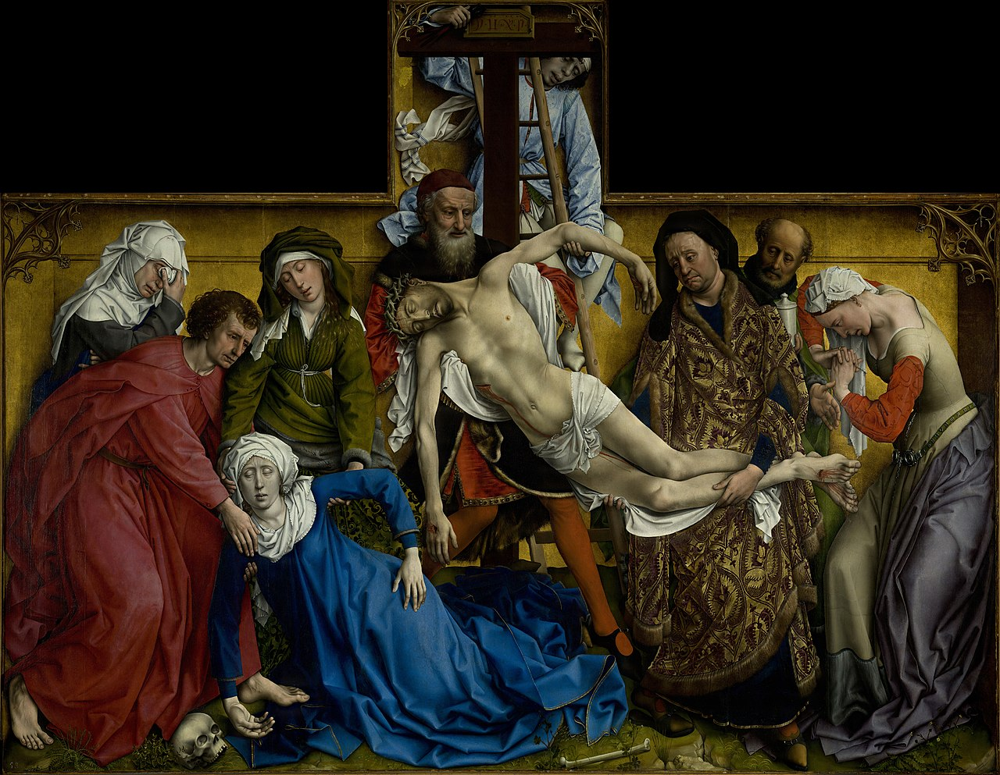

# Pinturas murales de Palomino en la cúpula del Sagrario de la Cartuja de Granada

## Breve introducción histórica

## Materiales y técnicas de ejecución

### Tipos de mortero

### Dibujo preparatorio

### Técnica pictórica

### Pigmentos

# El Descendimiento de Roger van der Weyden, Museo Nacional del Prado

**Figura 1**: El Descendimiento de Van Der Weyden, imagen de dominio público [descargada de Wikimedia Commons](https://es.m.wikipedia.org/wiki/Archivo:El_Descendimiento,_by_Rogier_van_der_Weyden,_from_Prado_in_Google_Earth.jpg#).

## Contexto general

Van der Weyden nació en Doornik/Tournai en 1399, en lo que entonces era Borgoña, llegando a convertirse en pintor oficial de la corte en Bruselas [@gregory85:_van_weyden]. Se formó como aprendiz de Robert Campin, otro pintor de la misma ciudad. Junto con el resto de los denominados "Primitivos flamencos", como Van Eyck, fue la primera escuela que utilizó el óleo y se esforzó en un mayor realismo, logrado a través sobre todo de la extrema atención al detalle.

En esa época en los países bajos y Alemania se ha implantado una corriente reformista de la iglesia denominada *devotio moderna* [@salas2022devotio]. La *devotio moderna* busca una experiencia personal de la religión, incluyendo experimentar los sufrimientos de Cristo y la Virgen María y empatizar con los mismos. En el arte, esto se traduce en la creación de cuadros de pequeño formato para la devoción personal, que a su vez necesitan detalles, así como un color vivo y vibrante, que refleje todos los matices del sufrimiento. Esta necesidad de detalle y de color es posible que fueran factores en el uso de las técnicas pictóricas tales como los pinceles de un solo pelo y el uso de veladuras para conseguir profundidad del color y volumen en las figuras.

Como también se refleja en los cuadros de Van Eyck, la actividad comercial de los Países Bajos era considerable y estaba agrupada sobre todo en gremios, que encargaban cuadros a los diferentes artífices para mostrar en sus locales gremiales o adornar las capillas dedicadas por ellos en las iglesias. En concreto, este cuadro fue encargado por el Gran Gremio de los Arqueros (encargados, entre otras cosas, de fabricar ballestas en esta época) para la capilla de Nuestra Señora Extramuros de Lovaina [@campbell04].

El cuadro, fechado *antes de 1443* [@alcalde02] era parte de un retablo cuyas alas se han perdido, y refleja el momento del descendimiento de Cristo después de su crucifixión, correspondiendo tanto a la tipología de un Descendimiento como a la de un *compianto* o lamento por la muerte de cristo, con las siete figuras habituales en esta tipología: Las tres Marías (que incluyen a la Virgen), Nicodemo y San José de Arimatea, Cristo, la Magdalena y San Juan Evangelista, que tradicionalmente va vestido de rojo. Hay dos figuras adicionales, una de las cuales podría corresponder a algún cargo del gremio que hizo el encargo. El gremio también aparece reflejado a base de pequeñas ballestas disimuladas como parte del marco.

El cuadro es notable por el realismo de las figuras, pero también por la precisión con la que se reflejan diferentes fases y niveles de dolor ante la muerte de Cristo. Esta es una característica de la *devotio moderna*, que trata de presentar a las figuras evangélicas como humanas y por tanto cercanas, figuras con las que se puede empatizar. La postura de desvanecimiento de María se denomina *spasimo* y en este caso se usa de forma estructural en el cuadro, en paralelo al cuerpo de Cristo, y a la vez creando un ritmo diagonal en el cuadro, interrumpido por el paralelismo vertical del brazo de Cristo y el de María.

Los materiales reflejan la historia de la pieza, que tras ser instalada en la capilla para la que se creó, acabó en el Escorial, para lo que tuvo que ser desmontada, y finalmente fue instalada en el Museo del Prado  [@veliz2016caring], donde sufrió un proceso de restauración extensivo en los años 80 y 90 del siglo pasado [@miller2011development].

## Materiales y procedimientos

### Soporte

Como casi todos los primitivos flamencos, el soporte que se usa es roble del Báltico [@roble].
Las tablas están estructuradas en 11 tableros verticales [@asperen1983algunas]

> [unidos] mediante tres espiches de madera en cada junta, salvo en las centrales que son cuatro por ser de mayor tamaño.

Los bordes son biselados para poder incluirse en el marco original, que sin embargo se ha perdido; este marco posiblemente tuviera la misma apariencia que el marco en trampantojo incluido por el mismo cuadro.

Adicionalmente, en los años 90 se le añadió un mecanismo basado en muelles, desarrollado en el Metropolitan de Nueva York, que permita la expansión y contracción del cuadro con más sencillez [@miller2011development] y permitiendo ajustes de la tensión tanto en horizontal como en vertical. Sobre cada unión entre las tablas, embutidas a media madera, hay cuatro colas de milano; las tablas centrales, sin embargo, tienen 5 por ser más grandes [@asperen1983algunas]. El marco es de madera resinosa y reforzado con listones de madera; no es el original, pero sí es antiguo, aparentemente del siglo XIX.

### Preparaciones

La imprimación se ha hecho con una capa de yeso y cola [@SpringMarika2012TmoR]; adicionalmente, y por encima de la capa de dibujo (que trataremos a continuación) hay una capa de *imprimatura* de blanco de plomo con pigmento rojo opaco y algún negro ([@SpringMarika2012TmoR] citando a [@perez1994proceso]). Esta capa tendría un color gris rosáceo, según la fuente, seguramente contribuyendo sobre todo a las carnaduras de los diferentes personajes.

El blanco de plomo [@clair2018secret] o albayalde es un carbonato básico de plomo conocido desde la antigüedad. Palomino [@palomino] dice de él que

>... Es el pan de la pintura al ólio, pues sin él no se puede pintar, porque ayuda a todas las colores para graduar los claros, carnes y paños blancos.

Las imprimaturas basadas en plomo son, con diferentes combinaciones, la habitual en la pintura de los primitivos flamencos; y aunque no es totalmente blanca como podría ser lo aconsejable, sigue siendo una capa de un color ligero sobre la que trabajar; de hecho, es lo habitual en otras pinturas de esa época.

### Dibujo subyacente

[@asperen1983algunas] presenta un panorama bastante completo del dibujo subyacente en las diferentes partes del cuadro. Se da con pinceladas ligeras que no siempre corresponden con la superficie pictórica, usando técnicas específicas para las sombras, trazos "de tipo colmillo" (para superficies planas) y líneas paralelas para formas más profundas. Donde menos diferencia hay con el dibujo subyacente es la ropa; en las caras, sin embargo, hay muy poca coincidencia. 

También hay algunas correcciones en posiciones del cuerpo y en la ropa, apreciada en la radiografía.

No he encontrado como se hace el dibujo subyacente, pero en esta época se hacía normalmente con carboncillo. En todo caso, se encuentra al parecer debajo de la imprimatura y encima de la capa de preparación de yeso.

### Aglutinantes

### Pigmentos

### Dorados

### Barnices

# La coronación de la Virgen, Diego Rodríquez de Silva y Velázquez, Museo Nacional del Prado

## Contexto general

## Materiales y procedimientos

### Soporte

### Preparaciones

### Aglutinantes

### Pigmentos

### Dorados

### Barnices

# Referencias
